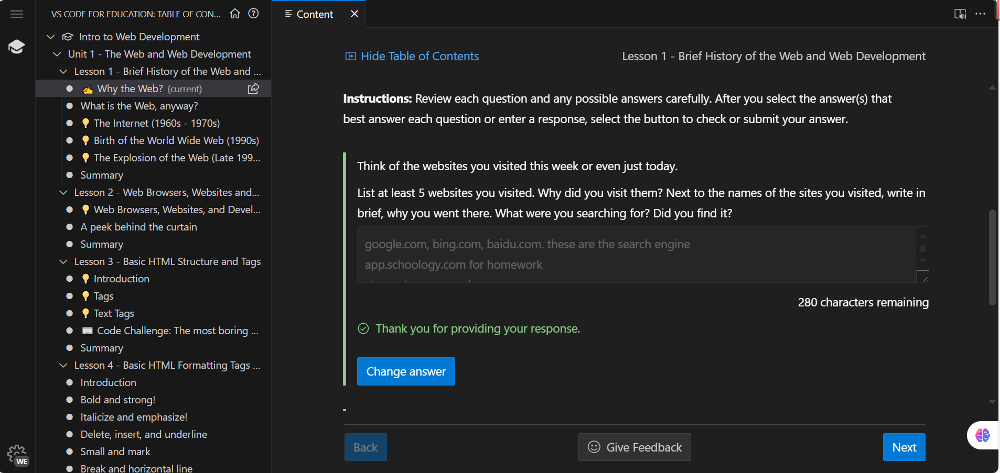
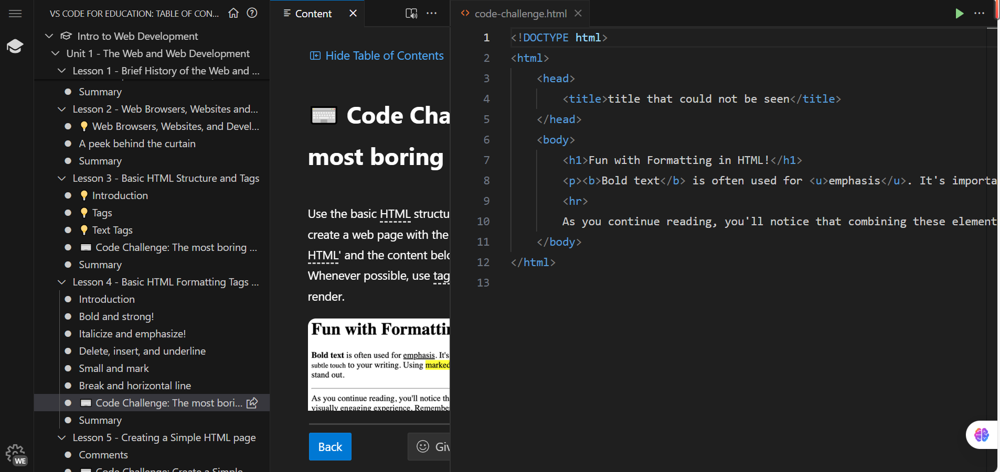

### **Unit one reflection:**
the picture showing me making progress:
the picture of code challenge:
reflection:in unit one, we learned the basic concept of internet and basic structure of HTML page(contains a head part and a body part). the head part contains things that didn't directly show in the user interface like title, while body part is the actual content we see like text, font size, font type and color. These are the common font type we use: **bold**, *italic*, ~~delete line~~, break , and horizontal line
---