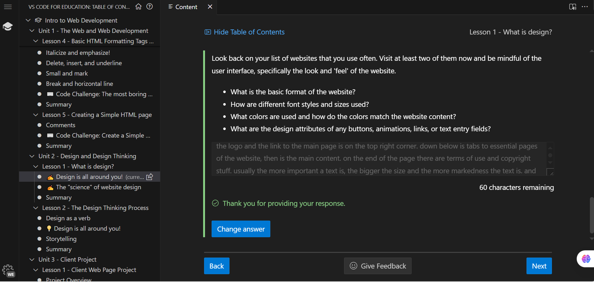

### **Unit two reflection:**

**the picture showing me making progress: **
**the picture of code challenge:None**

**Reflection**:in unit two, we learned the concept of design and the design thinking process. Design as refers to:a plan or drawing made to show the look and function of an object or system before it is built or made. something that is or has been intentionally created. or the process of creating them.
A well designed website is: functional, aesthetic, and easy to access. in order to do so, the process of design is divided into user interface and user experience.
the design thinking process has five parts:empathize, define, ideate, prototype, and test