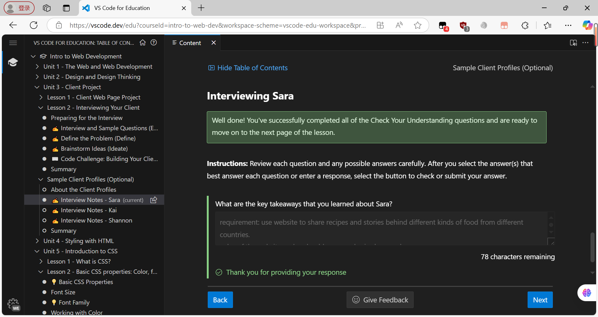
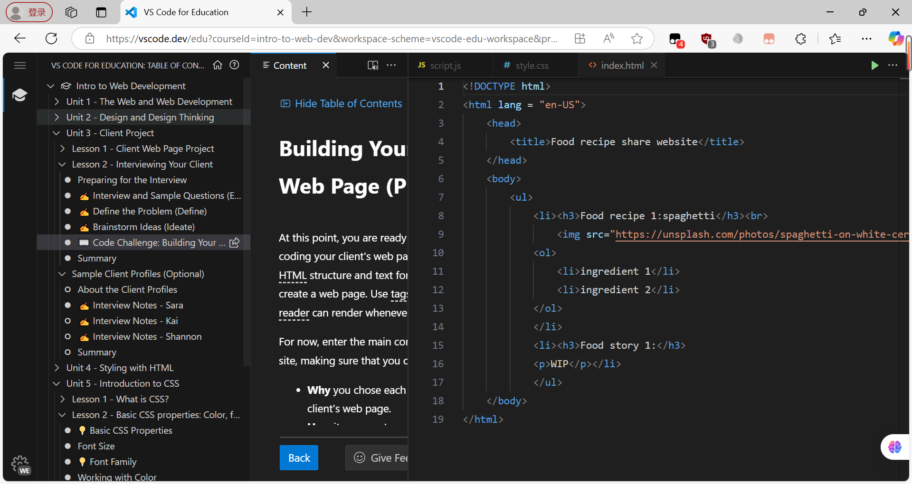

### **Unit three reflection:**

**the picture showing me making progress: **
**the picture of code challenge:**

**Reflection**:in unit three, we go deeper into the concept of design and the design thinking process. We simulate a situation that we are making a website for a certain client. In this case, name sara and want to make a website about food recipe and the story behind it.
I decided to make this website as my portfolio(or at least the prototype of it), now it may seems primitive, but later on it will improve.