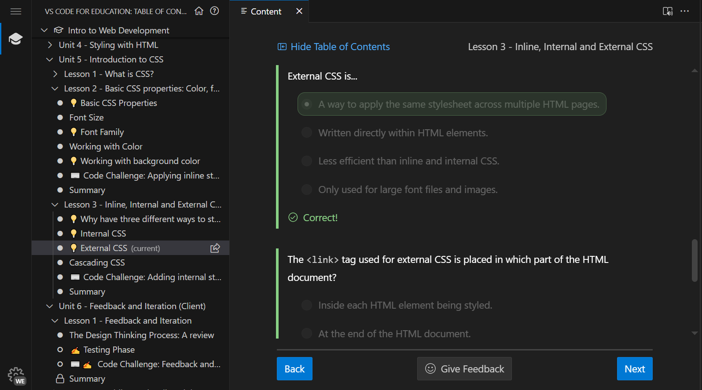
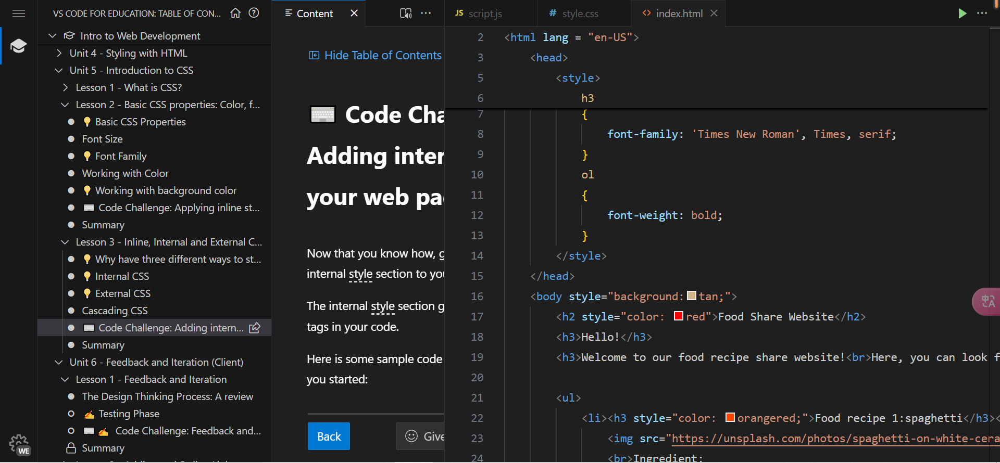

### **Unit five reflection:**

**the picture showing me making progress: **
**the picture of code challenge: **

**Reflection**:In unit four, we learn more about CSS rather than simply use "style" attribute to modify certain HTML tags. It can not only apply on almost every tag, but it also have a wide range of functions. In addition, we can use certain ways to make it apply to one typle of tag in the whole HTML page. Usually it's internal or external. They have different priority. From the lowest to the highest are: default settings, external style sheet, internal style sheet, inline attribute(highest).
CSS can do lots of stuffs, from changing the font, to modified whole background color.