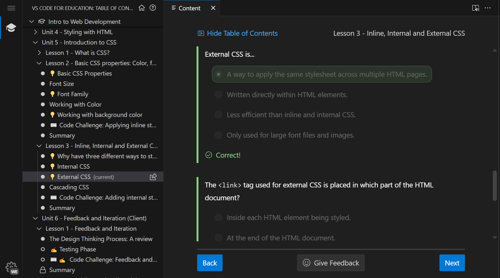

### **Unit four reflection:**

**the picture showing me making progress: **
**the picture of code challenge: **

**Reflection**:In unit four, we learn more about HTML styling such as attributes, image and different kinds of lists. Attribute can be the tooltip pop out when you hover on a certain text of the website, or the different page shown when your system language is different. Insert image is just... insert a image in the website. Although we can directly use a link to refer the image, it's not stable so we rather download it to local and use relative link.