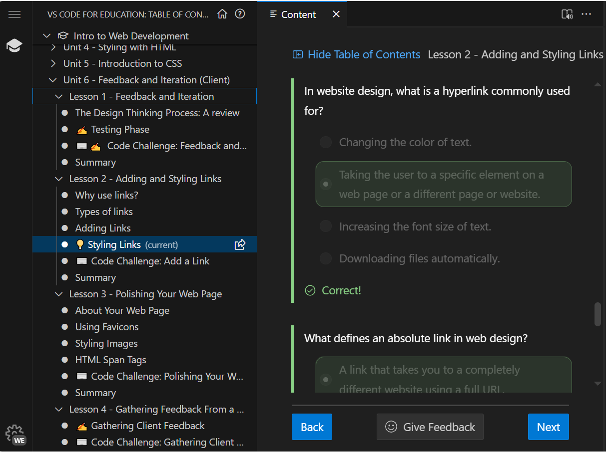
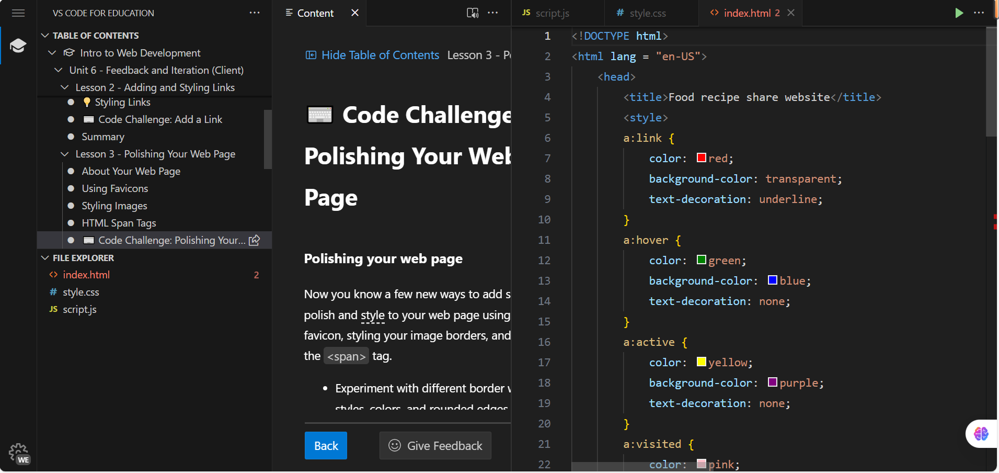

### **Unit six reflection:**

**the picture showing me making progress: **
**the picture of code challenge: **

**Reflection**:In unit six, we learn more about the CSS which can make the page more attractive, and more convenient for user to access, such as how to modified the border of pictures, modifiy the style of certain texts in a whole paragraph, or make the hyperlink more interactive. CSS is the answer to most of the styling of texts or graph. Also this unit taught me about getting feedback from the client and making iterations, but I don't have friends which have these kind of requirements and just use the sample client, making me impossible to do the feedback part.