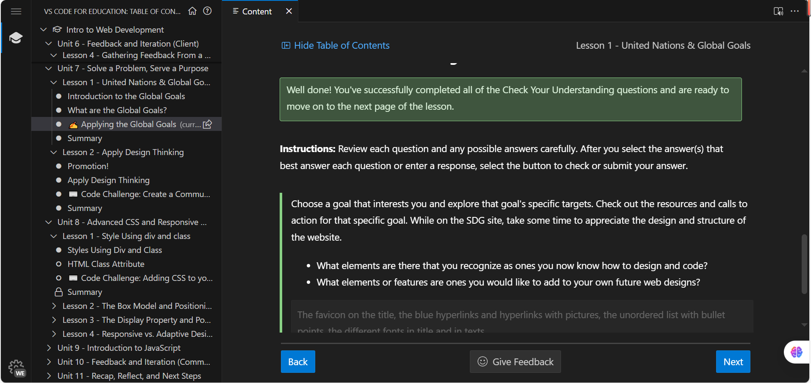
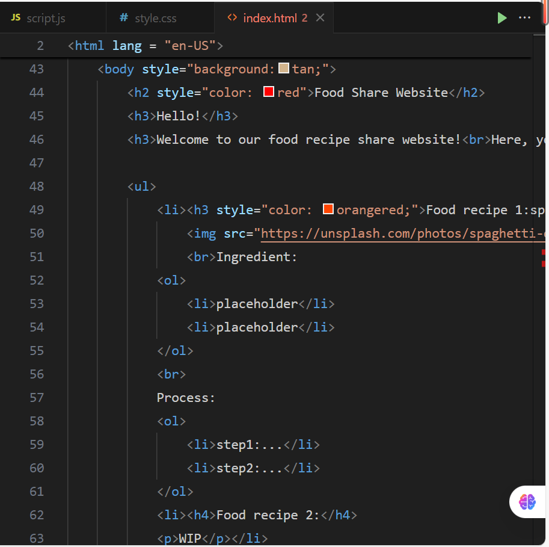

### **Unit seven reflection:**

**the picture showing me making progress:**
**the picture of code challenge: **

**Reflection**:Unit seven is a relatively small unit, in this unit, we look at the website of the United States and see how many of the elements inside we are able to design and code. Surprisingly, except the parts that does effects when click(like toolbars), the rest of the website I found that although my design isn't that well and beautiful, but I know which HTML tag and CSS attribute we need to achive these kind of effects:The favicon on the title, the blue hyperlinks and hyperlinks with pictures, the unordered list with bullet points, the different fonts in title and in texts... and so on.