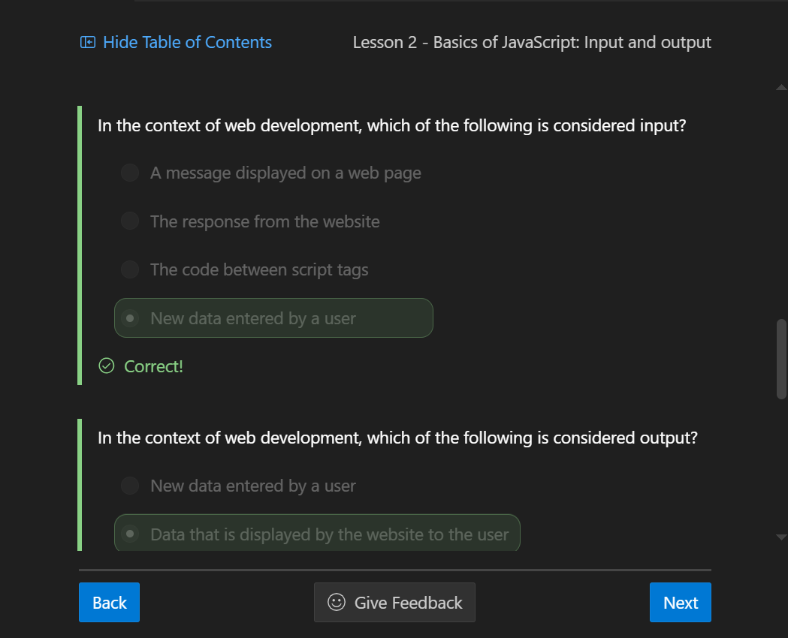
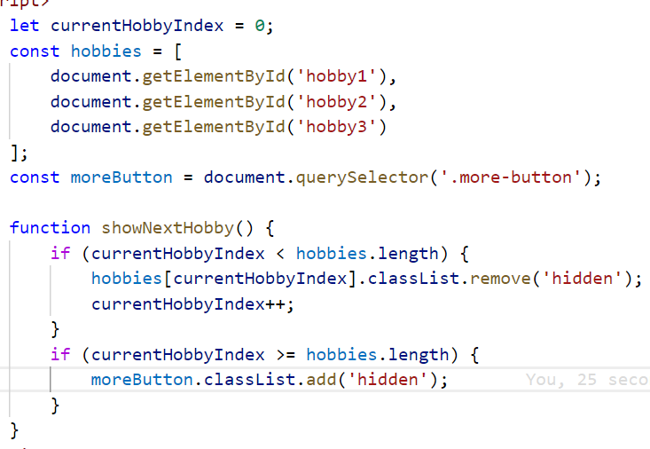

### **Unit nine reflection:**

**the picture showing me making progress:**
**the picture of code challenge:**
Reflection: this is another crucial component in daliy-use websites, every button you can click on these websites is powered by Javascript. It has the ablity of changing the "inner HTML"(for example, change one text to another text) without changing the sourcecode and refresh. And unlike C++, almost every Javascript relies on function and you write code(or script, depends on what you call these stuff) within it.